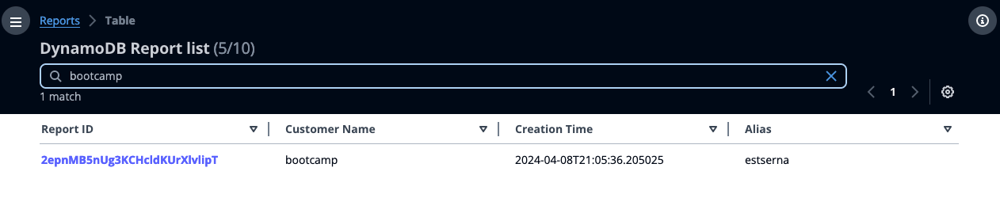
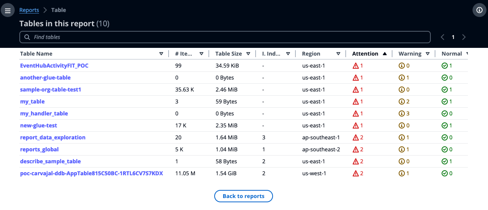
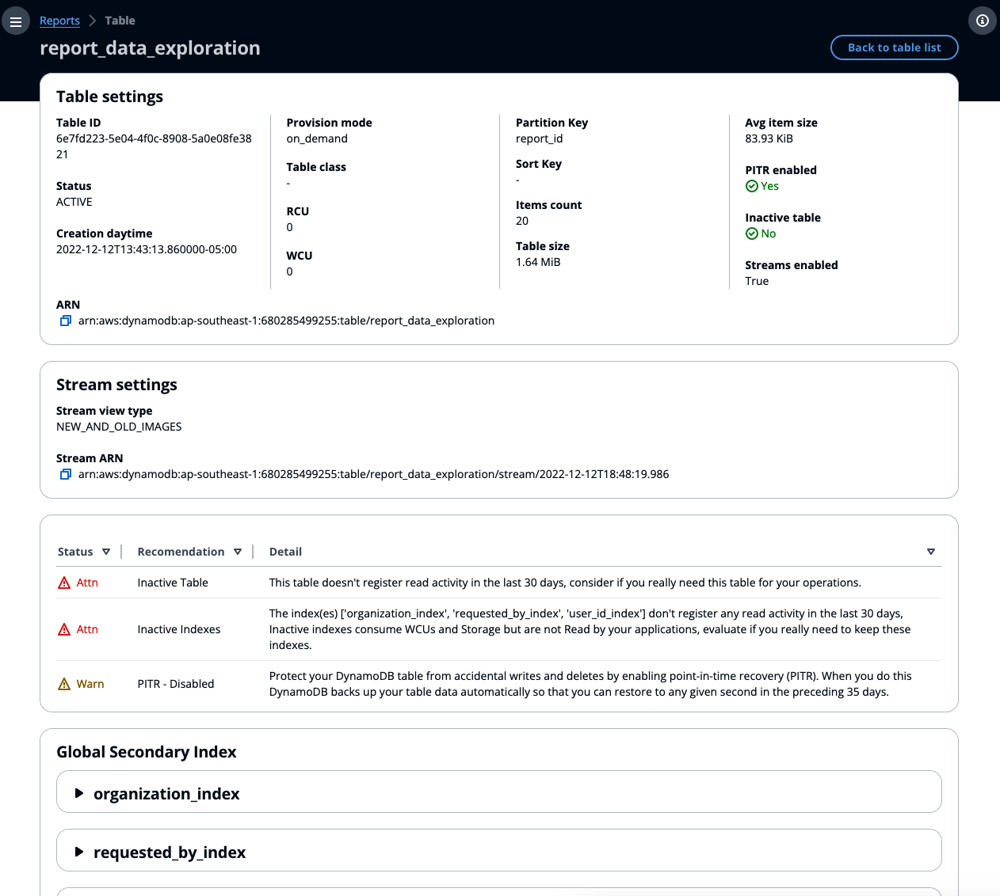

> [!NOTE]  
> We are actively working on improving the cost tool and the web portal suggestions, the links to upload the files and the web portal have been removed. Please use the [metrics-collector](../metrics-collector/README.md) to capture the information and generate recommendations. We are working on someting good! 


# DynamoDB Cost tool metrics and metadata retrieval

This script will help you obtain the table metadata and metrics for the tables in your current account.

You can specify via the parameter `--regions` the regions from where you want to obtain the information. If you specify `all` as parameter for your regions, this script will collect information for all the aws cloud regions avaialble (that you have access).


This is one sample excecution.

```shell
❯ cd cost_tool
❯ python ddb_cost_tool.py --regions us-east-1 us-east-2
us-east-1
Collecting DynamoDB tables metadata in us-east-1:
Obtaining information for table chalice-cost-sandbox-costtableCCA192A6-1WBAKAMYOYROL
Obtaining information for table describe_sample_table
Obtaining information for table my_handler_table
Obtaining information for table my_table
Obtaining information for table sample-org-table
Obtaining information for Continuous Backups for table chalice-cost-sandbox-costtableCCA192A6-1WBAKAMYOYROL
Obtaining information for Continuous Backups for table my_handler_table
Obtaining information for Continuous Backups for table my_table
Obtaining information for Continuous Backups for table sample-org-table
Obtaining information for Continuous Backups for table describe_sample_table
us-east-2
Collecting DynamoDB tables metadata in us-east-2:
Obtaining information for table describe_sample_table
Obtaining information for Continuous Backups for table describe_sample_table
Get metrics for 1 and 5 minutes
Working with table_id 7618f4f8-2fdf-4ca5-8dcf-a18c4f474e8a
Working with table_id 7442fbd5-0f2b-431a-badb-e2de080e342e
Working with table_id acbc28f5-0a22-4ad4-9038-e43da98dd5lsb6
Working with table_id 9f38ae29-ed3a-446c-b377-9cf3129680f1
Working with table_id 7abf7966-3dde-41b8-bc42-4b77339ab4af
Working with table_id 31f7719d-1a1e-4cd2-9eb3-ae9d79a41a1f
Finished processing table 7618f4f8-2fdf-4ca5-8dcf-a18c4f474e8a
Finished processing table 7abf7966-3dde-41b8-bc42-4b77339ab4af
Finished processing table 9f38ae29-ed3a-446c-b377-9cf3129680f1
Finished processing table acbc28f5-0a22-4ad4-9038-e43da98dd5b6
Finished processing table 7442fbd5-0f2b-431a-badb-e2de080e342e
Finished processing table 31f7719d-1a1e-4cd2-9eb3-ae9d79a41a1f

❯ ls ./output
31f7719d-1a1e-4cd2-9eb3-ae9d79a41a1f.tar.gz
7442fbd5-0f2b-431a-badb-e2de080e342e.tar.gz
7618f4f8-2fdf-4ca5-8dcf-a18c4f474e8a.tar.gz
7abf7966-3dde-41b8-bc42-4b77339ab4af.tar.gz
9f38ae29-ed3a-446c-b377-9cf3129680f1.tar.gz
acbc28f5-0a22-4ad4-9038-e43da98dd5b6.tar.gz
```

## Required permissions

The role that you will assume to execute this script needs provides access to this script to capture table metadata and CloudWatch metrics, you can always use the`"*"` value on the resource values below, however it is recommended to follow the least privilege access. You can create a role like the one in the example below to provide access to only the tables from `us-east-1` and `us-east-2`:

```JSON
{
    "Version": "2012-10-17",
    "Statement": [
        {
            "Sid": "DDBPermissions",
            "Effect": "Allow",
            "Action": [
                "dynamodb:DescribeTable",
                "dynamodb:ListTables",
                "dynamodb:DescribeContinuousBackups",
                "dynamodb:ListTagsOfResource"
            ],
            "Resource": ["arn:aws:dynamodb:us-east-1:<account-id>:table/*", "arn:aws:dynamodb:us-east-2:<account-id>:table/*" ]
        },
        {
            "Sid": "CloudWatchPermissions",
            "Effect": "Allow",
            "Action": "cloudwatch:GetMetricData",
            "Resource": "*"
        }
    ]
}

```

## Results - Deprecated

> [!NOTE]  
> We are actively working on improving the cost tool and the web portal suggestions, the links to upload the files and the web portal have been removed. Please use the [metrics-collector](../metrics-collector/README.md) to capture the information and generate recommendations. 

The `cost_tool/output` folder will contain the compressed results of this script, which can be directly uploaded to the DynamoDB Cost Portal.

You will need to enter the username `ddb-cost-tool` and the password `DDB-cost-tool-2024`. This portal will allow you to upload the metadata files so the cost optimization tool can provide the analysis.


After submitting your credentials, generate a new report. The current version includes 3 fields (`user_id`, `customer_name`, and `aws_alias`) that are utilized for report search. You may input any desired values for these fields, as they are solely for identification purposes when accessing the report results.Please provide the generated `report_id` to your AWS Account SA, or TAM, and ask them to retrieve the results in the DynamoDB Cost Optimization report page. Please notice Only AWS resources have access to this page.

When the analysis is complete, your AWS representative can access the report:



Once you select the report ID, the uploaded tables will be displayed.



Clicking on the tables will provide you with in-depth information about each one.



If you have any issue, feedback or comment, please open an issue and tag the cost optimization tool or the script.

Thanks!
