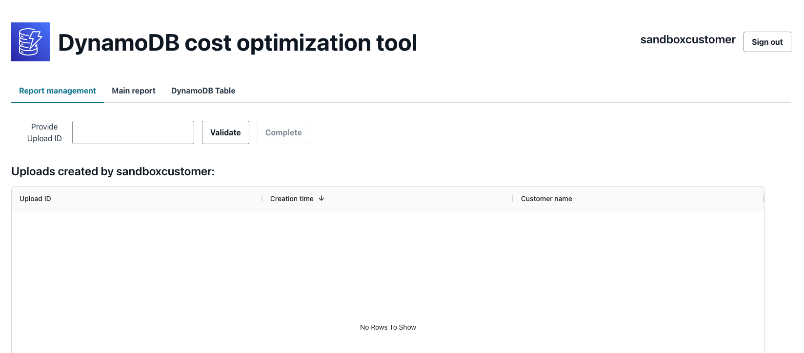
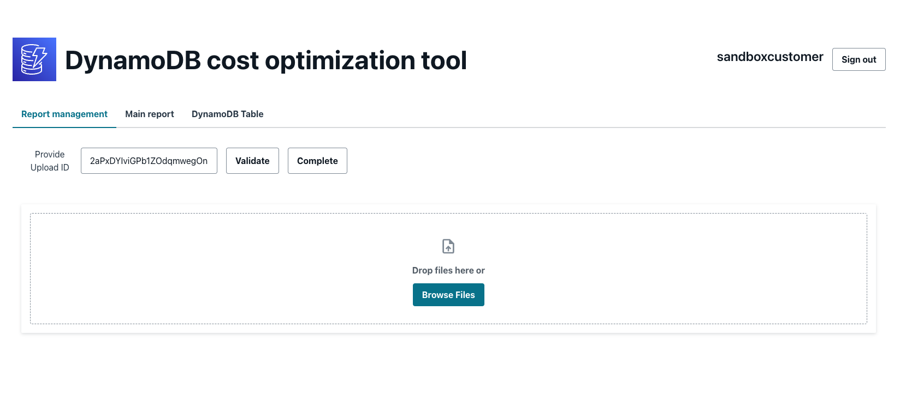
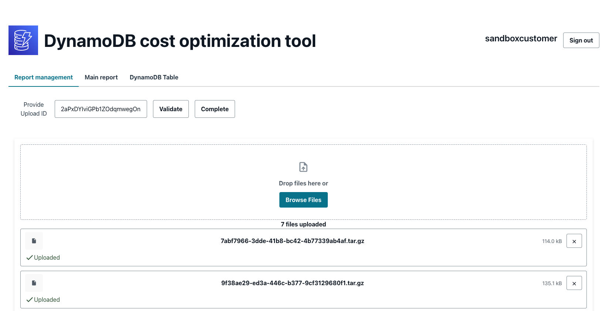
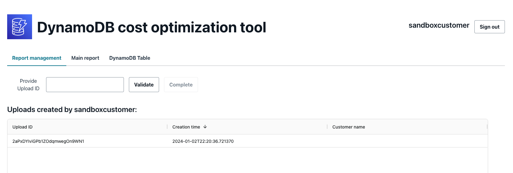

# DynamoDB Cost tool metrics and metadata retrieval

This script will help you obtain the table metadata and metrics for the tables in your current account.

You can specify via the parameter `--regions` the regions from where you want to obtain the information. If you specify `all` as parameter for your regions, this script will collect information for all the aws cloud regions avaialble (that you have access).


This is one sample excecution.

```shell
❯ cd cost_tool
❯ python ddb_cost_tool.py --regions us-east-1 us-east-2
us-east-1
Collecting DynamoDB tables metadata in us-east-1:
Obtaining information for table chalice-cost-sandbox-costtableCCA192A6-1WBAKAMYOYROL
Obtaining information for table describe_sample_table
Obtaining information for table my_handler_table
Obtaining information for table my_table
Obtaining information for table sample-org-table
Obtaining information for Continuous Backups for table chalice-cost-sandbox-costtableCCA192A6-1WBAKAMYOYROL
Obtaining information for Continuous Backups for table my_handler_table
Obtaining information for Continuous Backups for table my_table
Obtaining information for Continuous Backups for table sample-org-table
Obtaining information for Continuous Backups for table describe_sample_table
us-east-2
Collecting DynamoDB tables metadata in us-east-2:
Obtaining information for table describe_sample_table
Obtaining information for Continuous Backups for table describe_sample_table
Get metrics for 1 and 5 minutes
Working with table_id 7618f4f8-2fdf-4ca5-8dcf-a18c4f474e8a
Working with table_id 7442fbd5-0f2b-431a-badb-e2de080e342e
Working with table_id acbc28f5-0a22-4ad4-9038-e43da98dd5lsb6
Working with table_id 9f38ae29-ed3a-446c-b377-9cf3129680f1
Working with table_id 7abf7966-3dde-41b8-bc42-4b77339ab4af
Working with table_id 31f7719d-1a1e-4cd2-9eb3-ae9d79a41a1f
Finished processing table 7618f4f8-2fdf-4ca5-8dcf-a18c4f474e8a
Finished processing table 7abf7966-3dde-41b8-bc42-4b77339ab4af
Finished processing table 9f38ae29-ed3a-446c-b377-9cf3129680f1
Finished processing table acbc28f5-0a22-4ad4-9038-e43da98dd5b6
Finished processing table 7442fbd5-0f2b-431a-badb-e2de080e342e
Finished processing table 31f7719d-1a1e-4cd2-9eb3-ae9d79a41a1f

❯ ls ./output
31f7719d-1a1e-4cd2-9eb3-ae9d79a41a1f.tar.gz
7442fbd5-0f2b-431a-badb-e2de080e342e.tar.gz
7618f4f8-2fdf-4ca5-8dcf-a18c4f474e8a.tar.gz
7abf7966-3dde-41b8-bc42-4b77339ab4af.tar.gz
9f38ae29-ed3a-446c-b377-9cf3129680f1.tar.gz
acbc28f5-0a22-4ad4-9038-e43da98dd5b6.tar.gz
```

## Required permissions

The role that you will assume to execute this script needs provides access to this script to capture table metadata and CloudWatch metrics, you can always use the`"*"` value on the resource values below, however it is recommended to follow the least privilege access. You can create a role like the one in the example below to provide access to only the tables from `us-east-1` and `us-east-2`:

```JSON
{
    "Version": "2012-10-17",
    "Statement": [
        {
            "Sid": "DDBPermissions",
            "Effect": "Allow",
            "Action": [
                "dynamodb:DescribeTable",
                "dynamodb:ListTables",
                "dynamodb:DescribeContinuousBackups",
                "dynamodb:ListTagsOfResource"
            ],
            "Resource": ["arn:aws:dynamodb:us-east-1:<account-id>:table/*", "arn:aws:dynamodb:us-east-2:<account-id>:table/*" ]
        },
        {
            "Sid": "CloudWatchPermissions",
            "Effect": "Allow",
            "Action": "cloudwatch:GetMetricData",
            "Resource": "*"
        }
    ]
}

```

## Results

The results of this scripts will be stored in the `cost_tool/output` folder, they are already compressed and ready to upload to the DynamoDB Cost Portal, ask your SA to provide a upload ID so you can upload the results to the DynamoDB Cost Portal. 

Fill the Upload ID and click in "Validate". If the id is valid, the screen will change so you can upload the compressed files.



You can browse or drag and drop your files, you can upload up to 100 at the time.



Once they are all completed you can click in the "Complete" Button to finalize the process.



The previous procedure will start the analisys process where it will provide cost recommendations based on the information you have uploaded. Notice that you only have access to the uploads IDs that are provided by your Account SA, but also to the uplodas that you process.
